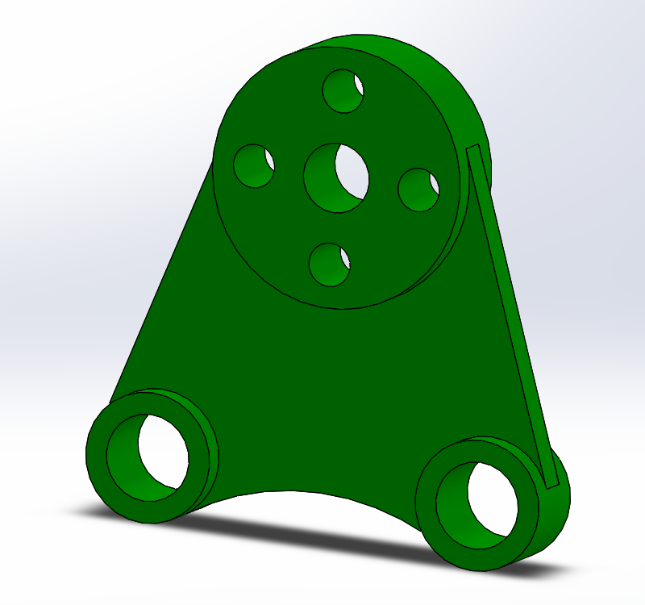

# Part-drawing-3-SW 
This project demonstrates the intermediate-level of a spanner using solidworks. the aim is to accurately replicate the geometry,features and dimensions of the part. This design is fully defined.
## File Included
- 'project3_nishchay.  SLDPRT' -
solidworks part file
## License
this project is licensed under the MIT license.

