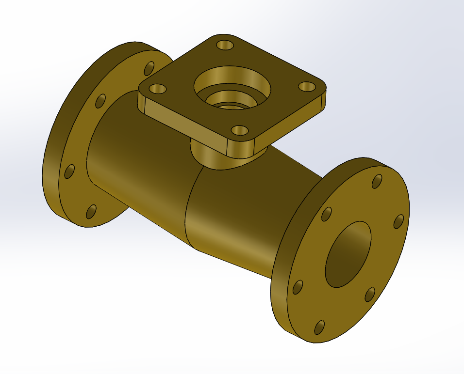

# Part-drawing-8-SW
This project demonstrates the intermediate-level of a spanner using solidworks. the aim is to accurately replicate the geometry,features and dimensions of the part. This design is fully defined.This is a 3D model of a flanged pipe connector designed with a valve mounting base.It features two standard flanged ends for pipe integration and a raised platform for attaching valves or sensors.
Applications:
> Industrial piping systems
> Fluid transport setups
> Valve assembly units
> Hydraulic and pneumatic networks

## File Include
- 'project08_nishchay.  SLDPRT' -
solidworks part file
## License
this project is licensed under the MIT license.

