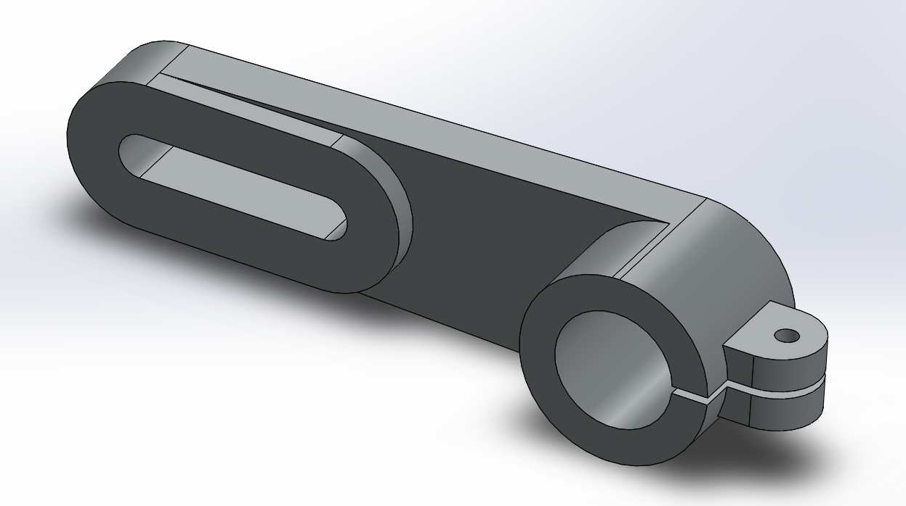

# Part-drawing-9-SW
This project features the 3D modeling of an Anchor Bracket designed using SolidWorks. the design created is fully defined. The bracket includes structural features like:
>A slotted hole for adjustable mounting
>A cylindrical hinge mount with a hole for fasteners
>Rounded edges and fillets for stress reduction

Key Design Highlights:

>Designed for mechanical assemblies requiring pivot or anchor points
>Focus on manufacturability and strength
>Suitable for applications where adjustable positioning is necessary

File Included:

SolidWorks part file (.SLDPRT)

Rendered image preview (.png)

---

## File Include
- 'project09_nishchay.  SLDPRT' -
solidworks part file
## License
this project is licensed under the MIT license.

