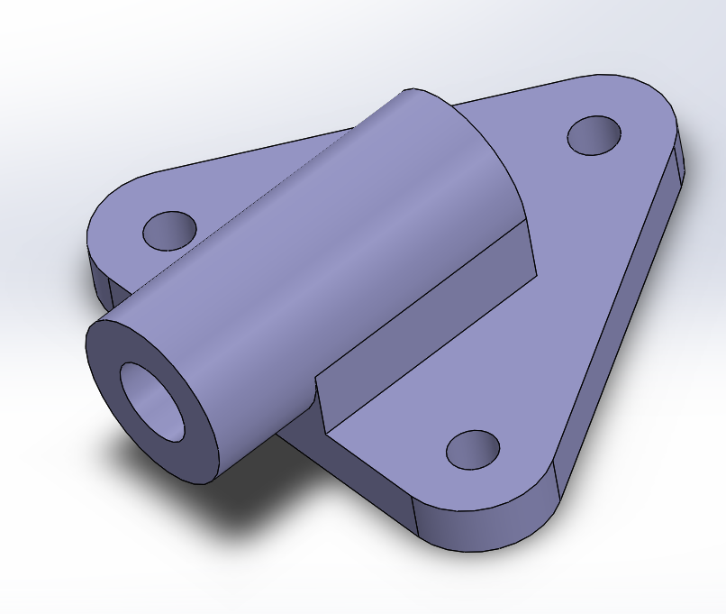

# Part-drawing-10-SW
This project showcases a 3D model of a Socket Bearing, created using SolidWorks as part of a learning and skill-building exercise in mechanical CAD design. A socket bearing is typically used in mechanical systems that require both rotational and angular movement, such as robotic joints or suspension systems. It consists of an inner race, outer race, spherical ball, and a socket housing to allow multidirectional motion with reduced friction.

The design is fully defined, with all dimensions, mates, and constraints accurately applied to reflect a realistic and functional component. It is suitable for educational use, mechanical simulations, and integration into larger assembly models.

This repository aims to demonstrate modeling techniques, parametric design, and clean assembly structure, and is open for feedback and collaboration.

File Included:

>SolidWorks part file (.SLDPRT)

>Rendered image preview (.png)

---

## File Include
- 'project10_nishchay.  SLDPRT' -
solidworks part file
## License
this project is licensed under the MIT license.

