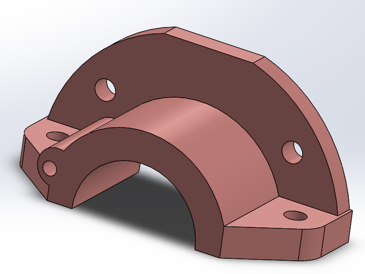

# Part-drawing-11-SW

Dust Cap (SolidWorks 3D Model)

A robust and functional Dust Cap model created using SolidWorks. This part is designed to cover and protect open ends of pipes, shafts, or mechanical housings from dust, debris, and environmental contaminants. Ideal for industrial, automotive, and machinery applications.

Key Features-

>Curved protective cover for pipe/shaft ends.

>Fully defined Sketch.

>Flange base with mounting holes for secure attachment

>Chamfers and fillets for improved strength and finish

Applications-

Sealing and protection of exposed shafts and bearing housings.

Dust cover for pipe terminations and mechanical assemblies.

Temporary or permanent protective cap in industrial equipment.

Author

Nishchay Sharma

>B.Tech (Mechanical Engineering)| Gold Medalist — 2024

>Design Engineer

Thanks for Viewing!

## File Include
- 'project11_nishchay.  SLDPRT' -
solidworks part file
## License
This project is licensed under the MIT license.

### Isometric View-

