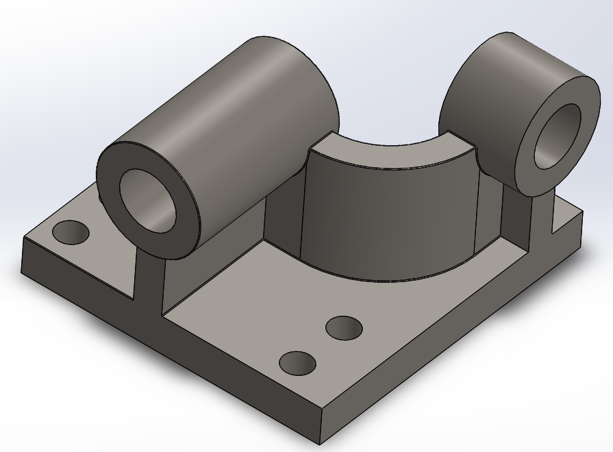

# Part-drawing-12-SW

Lead Screw Bracket (SolidWorks Model)

Overview-

This repository contains the Lead Screw Bracket CAD model designed in SolidWorks. The component serves as a robust support bracket for a lead screw assembly, typically used in motion systems such as CNC machines, 3D printers, or linear actuators.

Features-

>SolidWorks Part File (.SLDPRT)

>Fully Defined Sketch.

>Parametric Design for easy modification.

>Clear Mounting Holes for secure attachment.

>Semi-Cylindrical Support optimized for lead screw alignment.

>Compact and Sturdy Base with 4 mounting holes for rigid placement.

Applications-

Linear motion systems

CNC machines and 3D printers

Automation fixtures

Mechanical assemblies requiring screw shaft support

Author-

Nishchay Sharma

>B.Tech (Mechanical Engineering)| Gold Medalist — 2024

>Design Engineer

## File Include
- 'project12_nishchay.  SLDPRT' -
solidworks part file
## License
This project is licensed under the MIT license.

### Isometric View-

Thanks for Viewing!