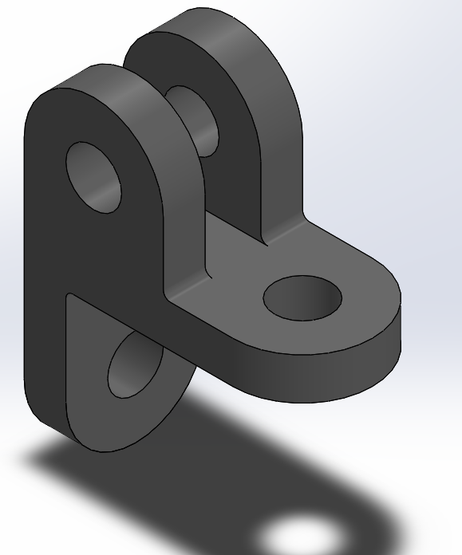

# Part-drawing-13-SW

Connector Component — SolidWorks Model

Overview

This repository contains a 3D CAD model of a Connector Component, designed using SolidWorks. The part is typically used for mechanical linkages where rotational or pivoting motion is required between two components, allowing a pin or fastener to pass through aligned holes.

Features

Double Lug Design: Provides stable clamping or fastening by sandwiching a mating part.

Through Holes: Precisely placed holes for bolted or pinned connections.

Filleted Edges: Enhanced stress distribution and improved aesthetics.

Symmetrical Geometry: Ensures ease of assembly and uniform load transfer.

Applications

Mechanical Linkages

Structural Frames and Joints

Automotive and Aerospace Assemblies

Robotics and Automation Fixtures

Author-

Nishchay Sharma

>B.Tech (Mechanical Engineering)| Gold Medalist — 2024

>Design Engineer

## File Include
- 'project13_nishchay.  SLDPRT' -
solidworks part file
## License
This project is licensed under the MIT license.

### Isometric View-

Thanks for Viewing!