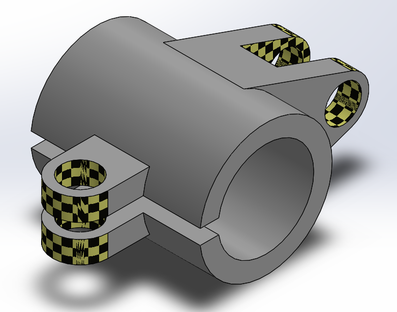

# Part-drawing-14-SW

# Split Clamp Bracket (SolidWorks Part Model)

This repository contains the CAD model of a *Split Clamp Bracket*, designed using SolidWorks. The component is commonly used in mechanical assemblies to securely hold cylindrical rods, shafts, or pipes in place using bolted joints.

## Features

- Parametric design with defined constraints.

- Split clamp mechanism for secure shaft mounting.

- Bolt holes with clearance and counterbore features.

- Ideal for prototyping, fixture assemblies, or mechanical mounts.

## Applications

- Shaft or rod holding in mechanical setups.

- Fixtures and clamping mechanisms.

- Mounting brackets in industrial applications.

Author-

Nishchay Sharma

>B.Tech (Mechanical Engineering)| Gold Medalist — 2024

>Design Engineer

## File Include
- 'project14_nishchay.  SLDPRT' -
solidworks part file

## License
This project is licensed under the MIT license.

### Isometric View-

Thanks for Viewing!