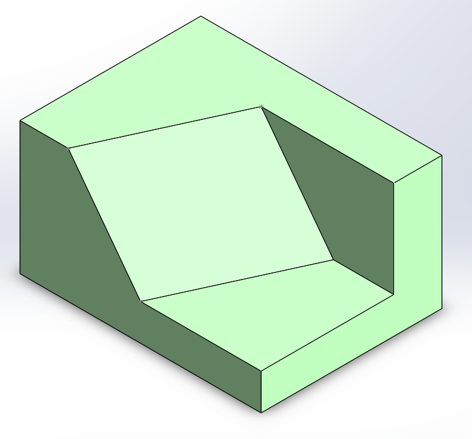

# Part-drawing-15-SW

# Hexagonal Frame Support

A custom-designed SolidWorks part featuring a hollow hexagonal frame with reinforced support walls.
  
This component can be utilized in structural assemblies where both geometric aesthetics and strength are required.

## Application Areas
> Structural frames  

> Modern architecture design elements  

> Industrial component housings 
 
> Custom mechanical assemblies

Author-

Nishchay Sharma

>B.Tech (Mechanical Engineering)| Gold Medalist — 2024

>Design Engineer

## File Include
- 'project15_nishchay.  SLDPRT' -
solidworks part file

## License
This project is licensed under the MIT license.

### Isometric View-

Thanks for Viewing!