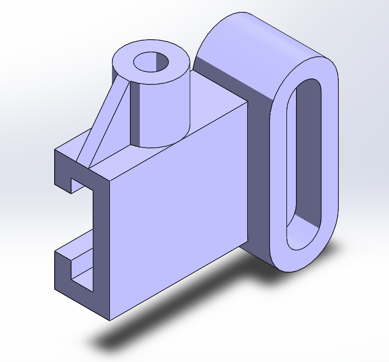

# Part-drawing-16-SW

# Mounting Bracket with Clamp and Slot

This project contains a 3D CAD model of a *Mounting Bracket with an integrated Clamp and Slotted Hole*, designed using SolidWorks. The component is suitable for mechanical assemblies requiring secure mounting with adjustability and cable-routing or fastening features.

## Features

- *Clamp Slot*: Open-ended clamp section for quick attachment.

- *Cylindrical Boss with Hole*: For bolt/shaft insertion or rotational mounting.

- *Elongated Slot*: For adjustable fastening or cable routing.

- *Reinforcement Ribs*: To improve structural stability.

## Applications

- Robotics mounts 
 
- Mechanical assemblies with adjustable fastening  

- Sensor or module holders

##Author-

Nishchay Sharma

>B.Tech (Mechanical Engineering)| Gold Medalist — 2024

>Design Engineer

## File Include
- 'project16_nishchay.  SLDPRT' -
solidworks part file

## License
This project is licensed under the MIT license.

### Isometric View-

Thanks for Viewing!