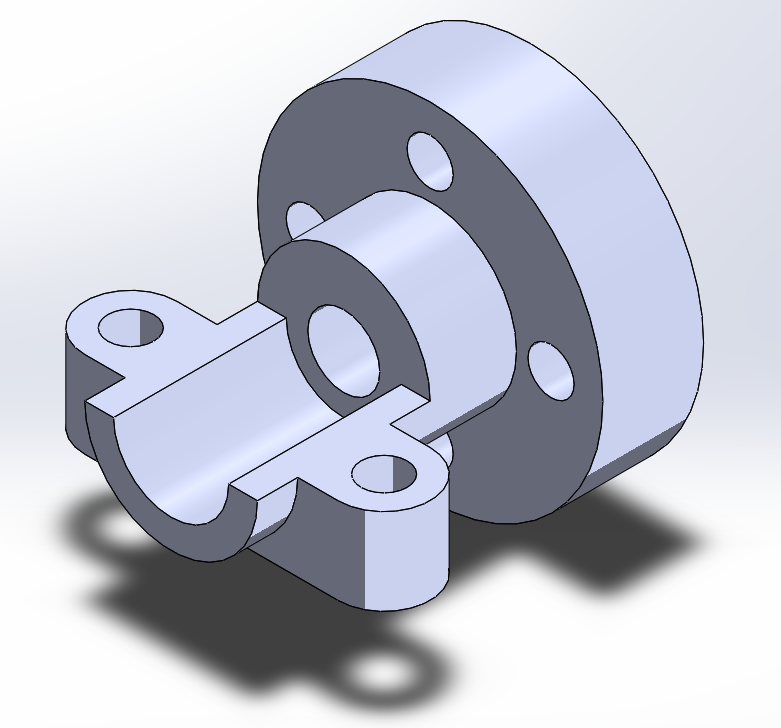

# Part-drawing-17-SW

# SolidWorks Intermediate Part – Support Bracket

This repository contains the SolidWorks model of a *Support Bracket*, designed as part of my intermediate-level SolidWorks practice projects. The component is a flanged bracket typically used for securing shafts, pipes, or cylindrical components to a flat surface.

## Features

- *Flanged Base* with countersunk holes for secure mounting 
 
- *Central Boss* with through-hole for shaft or fastener accommodation  

- *Support Arms* designed with bolt holes for fixture stability  

- Fully parametric and editable SolidWorks file

## Design Specifications

- Modeled using SolidWorks 2023 
 
- Features used: Extrude Boss/Base, Cut-Extrude, Fillet, Hole Wizard 
 
- Dimensions can be customized based on application requirements

## Author

Nishchay Sharma

>B.Tech (Mechanical Engineering)| Gold Medalist — 2024

>Design Engineer

## File Include
- 'project17_nishchay.  SLDPRT' -
solidworks part file

## License
This project is licensed under the MIT license.

### Isometric View-

Thanks for Viewing!