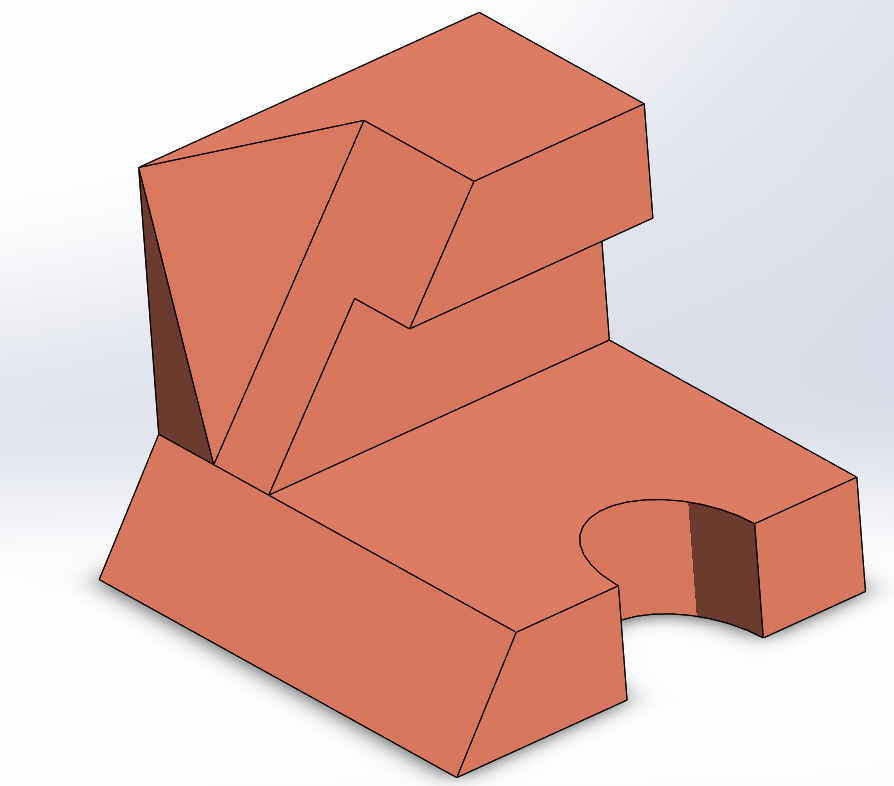

# Part-drawing-18-SW

# Stepped Bracket | SolidWorks Model

This repository contains the SolidWorks 3D CAD model of a *Stepped Bracket* (also called an Angular Support Block). This part features angular faces, stepped surfaces, and a semicircular cutout designed for applications such as fixturing, mounting, or structural support in mechanical assemblies.

## Features

- Stepped profile with intersecting angular faces

- Semicircular cutout for clearance or fitting

- Suitable for fixture design and structural support demonstrations

- Fully parametric and editable SolidWorks file

## Applications

- Jigs and fixtures

- Mounting brackets

- Educational demonstrations (CAD modeling, drafting, and GD&T)

## Design Specifications

- Modeled using SolidWorks 2023 
 
- Features used: Extrude Boss/Base, Cut-Extrude, Fillet, Hole Wizard 
 
- Dimensions can be customized based on application requirements

## Author

Nishchay Sharma

>B.Tech (Mechanical Engineering)| Gold Medalist — 2024

>Design Engineer

## File Include
- 'project18_nishchay.  SLDPRT' -
solidworks part file

## License
This project is licensed under the MIT license.

### Isometric View-

Thanks for Viewing!