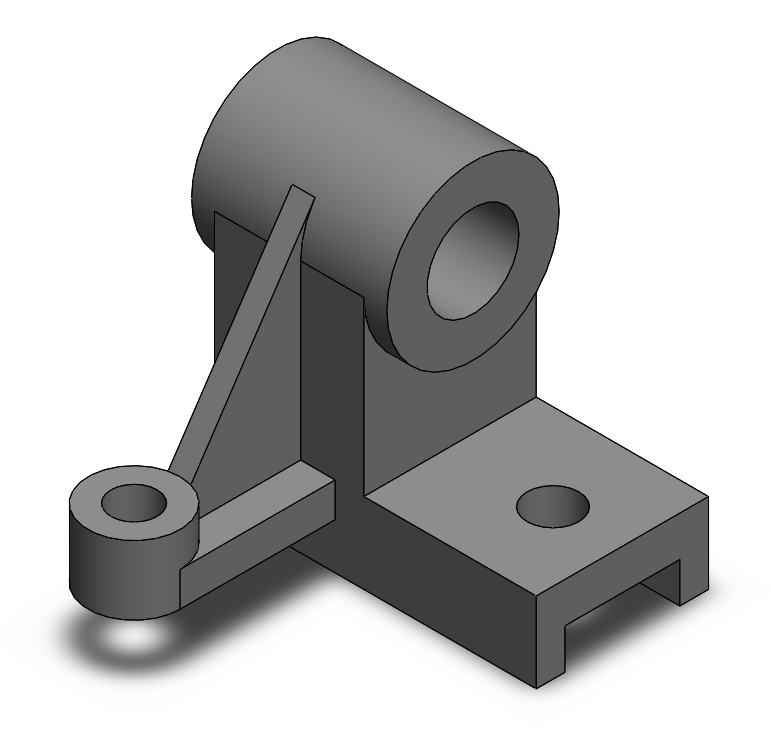

# Part-drawing-19-SW

# Bracket with Rib Support and Boss Mount 

This repository contains a parametric 3D model of a mechanical bracket featuring a cylindrical boss, rib reinforcement, and mounting base. The component is designed for structural applications requiring rotational shafts or pin support along with mounting stability.

## Key Features

- *Cylindrical Boss*: Suitable for shaft, pin, or bushing insertion.

- *Rib Reinforcement*: Enhances strength and rigidity against bending loads.

- *Mounting Base*: Provides holes for bolting the bracket to a surface or frame.

- *Machinable Geometry*: Suitable for 3D printing, CNC machining, or casting.

- Fully parametric and editable SolidWorks file

## Applications

- Mechanical assemblies

- Fixtures and jigs

- Structural mounts

## Design Specifications

- Modeled using SolidWorks 2023 
 
- Features used: Extrude Boss/Base, Cut-Extrude, Fillet, Hole Wizard 
 
- Dimensions can be customized based on application requirements

## Author

Nishchay Sharma

>B.Tech (Mechanical Engineering)| Gold Medalist — 2024

>Design Engineer

## File Include
- 'project19_nishchay.  SLDPRT' -
solidworks part file

## License
This project is licensed under the MIT license.

### Isometric View-

Thanks for Viewing!