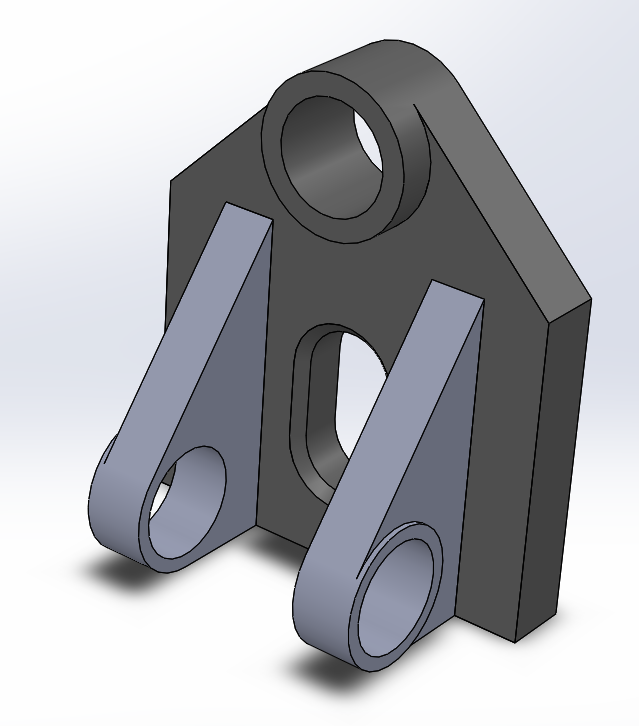

# Part-drawing-20-SW

# Bracket Mounting Assembly

This project showcases a mechanical *Bracket Mounting Assembly* modeled in SolidWorks. The design features mounting holes, reinforcement ribs, and a robust geometry ideal for mechanical linkages or fixture applications.

## Features

- Reinforced ribbed structure for added strength

- Dual mounting arms with through-holes

- Central circular and slot features for multipurpose connectivity

- Suitable for mechanical assemblies, linkages, and fixtures

- Fully parametric and editable SolidWorks file

## Software Used

- *CAD Tool*: SolidWorks 2023

- *File Format*: .SLDPRT, .PNG (render)

## Applications

- Linkage mounting brackets

- Fixture assemblies in mechanical setups

- Robotics and machine components

## Design Specifications

- Modeled using SolidWorks 2023 
 
- Features used: Extrude Boss/Base, Cut-Extrude, Fillet, Hole Wizard 
 
- Dimensions can be customized based on application requirements

## Author

Nishchay Sharma

>B.Tech (Mechanical Engineering)| Gold Medalist — 2024

>Design Engineer

## File Include
- 'project20_nishchay.  SLDPRT' -
solidworks part file

## License
This project is licensed under the MIT license.

### Isometric View-

Thanks for Viewing!