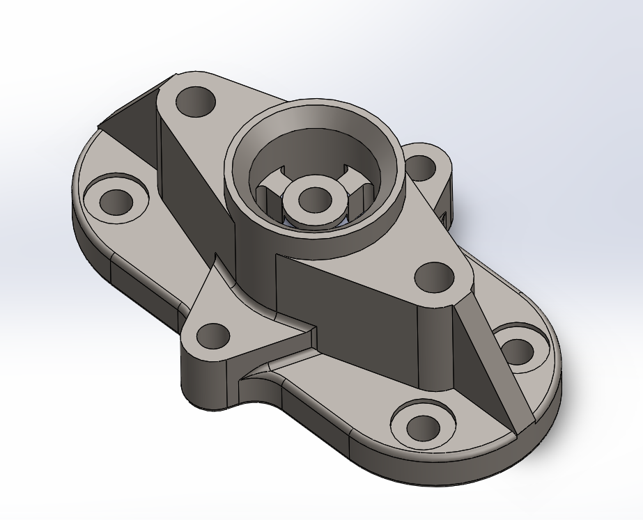

# Part-drawing-21-SW

# Flanged Mounting Base - SolidWorks Model

This repository contains the 3D CAD model of a *Flanged Mounting Base*, created using SolidWorks. This part is designed to support a shaft or bearing and is commonly used in mechanical systems for mounting and alignment purposes.

## Key Features

- Modeled in SolidWorks

- Four-hole flange design for stable mounting

- Central cylindrical cavity for bearing/shaft placement

- Rigid and lightweight geometry

## Applications

- Mechanical housing components

- Shaft and bearing support structures

- Machinery mounting interfaces

## Design Specifications

- Modeled using SolidWorks 2023 
 
- Features used: Extrude Boss/Base, Cut-Extrude, Fillet, Hole Wizard 
 
- Dimensions can be customized based on application requirements

## Author

Nishchay Sharma

>B.Tech (Mechanical Engineering)| Gold Medalist — 2024

>Design Engineer

## File Include
- 'project21_nishchay.  SLDPRT' -
solidworks part file

## License
This project is licensed under the MIT license.

### Isometric View-

Thanks for Viewing!