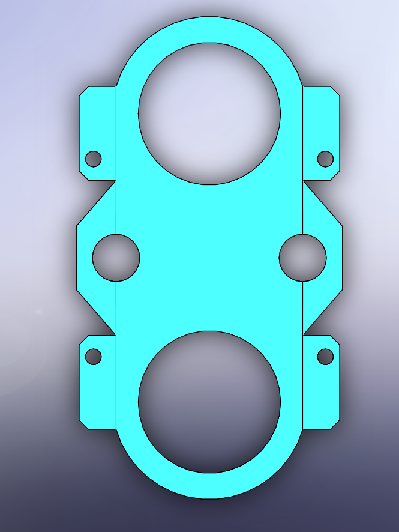
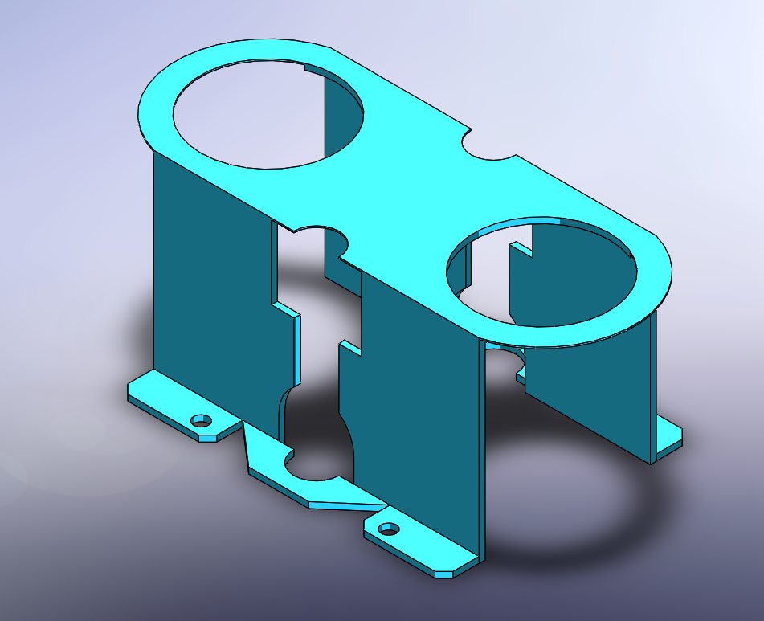

# Part-drawing-22-SW

# Dual Cylinder Mounting Bracket

This SolidWorks model represents a custom-designed *Dual Cylinder Mounting Bracket*. It is intended to securely hold and support two cylindrical components in a parallel configuration.

## 🧩 Features

- Dual circular cutouts for cylinder holding

- Reinforced base with screw holes for mounting

- Cutouts and fillets for material efficiency and weight reduction

- Ideal for sensor rigs, pipe mounts, or small compressed gas cylinders

## 📐 Dimensions

The model can be modified parametrically to suit your specific dimensions or cylinder sizes.

## 🛠 Tools Used

- *Software:* SolidWorks (Intermediate Level)

- *Features:* Extruded Boss/Base, Cut-Extrude, Fillet, Mirror, Pattern

## 📁 File Info

- Dual_Cylinder_Mounting_Bracket.SLDPRT

- Compatible with SolidWorks 2018 or later

## Author

Nishchay Sharma

>B.Tech (Mechanical Engineering)| Gold Medalist — 2024

>Design Engineer

## File Include
- 'project22_nishchay.  SLDPRT' -
solidworks part file

## License
This project is licensed under the MIT license.

### Top View-

### Isometric View-

Thanks for Viewing!