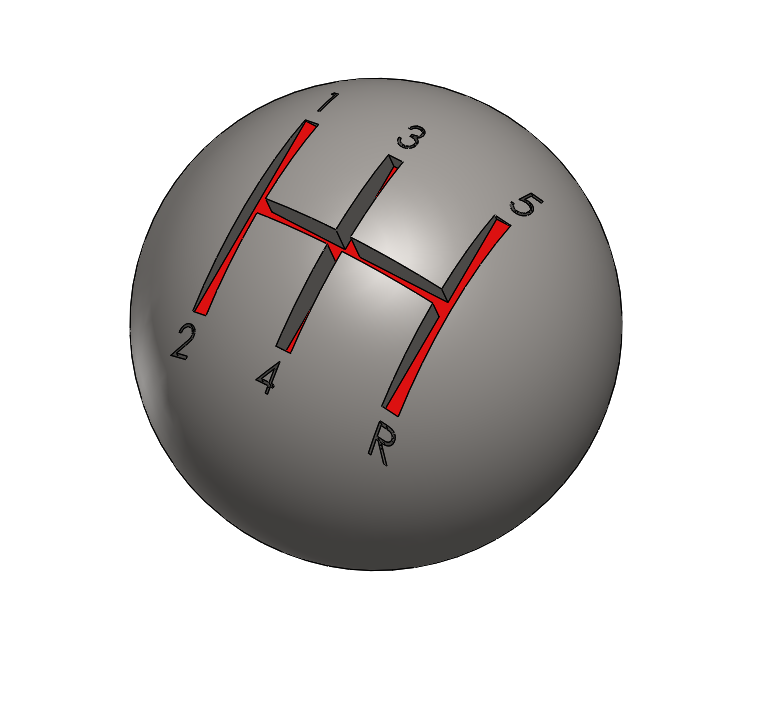

# Part-drawing-23-SW

# ⚙️ Gear Shifter Ball

A customizable gear shifter ball design for automotive enthusiasts and makers. Whether you're upgrading your ride or looking for a unique DIY project, this gear shifter ball is easy to print, assemble, and install.

## 📦 Features

- Ergonomic and stylish design

- Threaded insert support for easy installation

- Customizable surface (engraving, paint, etc.)

- Compatible with most manual transmission gear sticks

## 📁 Files

- `gear_shifter_ball.stl` — Ready-to-print model

- `gear_shifter_ball.step` — Editable CAD file

- `README.md` — This documentation

## 🧑‍💻 Contributions

Pull requests are welcome! Feel free to fork the repo and suggest improvements.

---

 

## Author

Nishchay Sharma

>B.Tech (Mechanical Engineering)| Gold Medalist — 2024

>Design Engineer

Made with passion for cars and 3D printing. 

## File Include
- 'project23_nishchay.  SLDPRT' -
solidworks part file

## License
This project is licensed under the MIT license.

### Isometric View-

Thanks for Viewing!