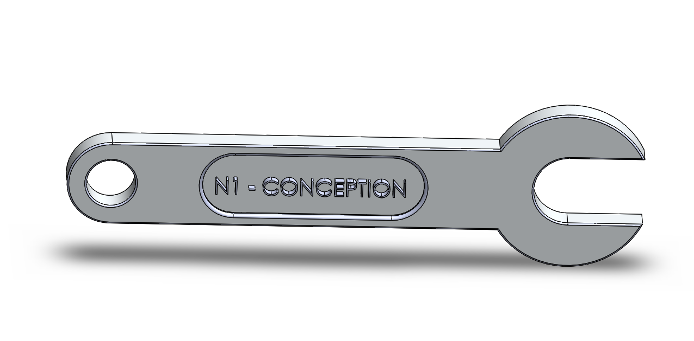
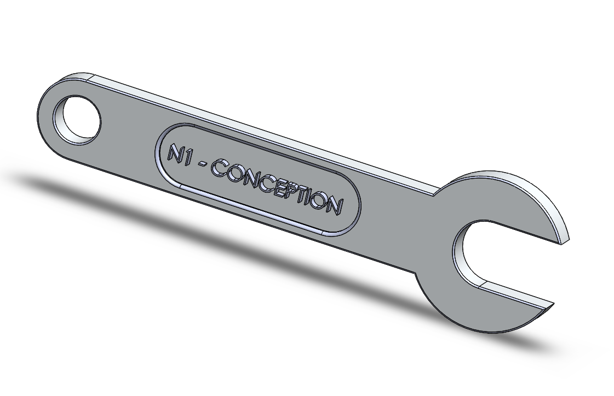

# Part-drawing-24-SW

###  Open-End Wrench Model

- 📏 Dimensions: Based on MMGS

- 🧰 Material: Alloy Steel

- 📅 Drawing Date: 31 March 2025

- 📝 Drawing Type:- Part Modeling

- 📐 Features: Tangent propagation, concentric relations, R6 slot, symmetric extrusions

---

 

## Author

Nishchay Sharma

>B.Tech (Mechanical Engineering)| Gold Medalist — 2024

>Design Engineer

Made with passion for cars and 3D printing. 

## File Include
- 'project24_nishchay.  SLDPRT' -
solidworks part file

## License
This project is licensed under the MIT license.

### Isometric View-

### Isometric View-

Thanks for Viewing!