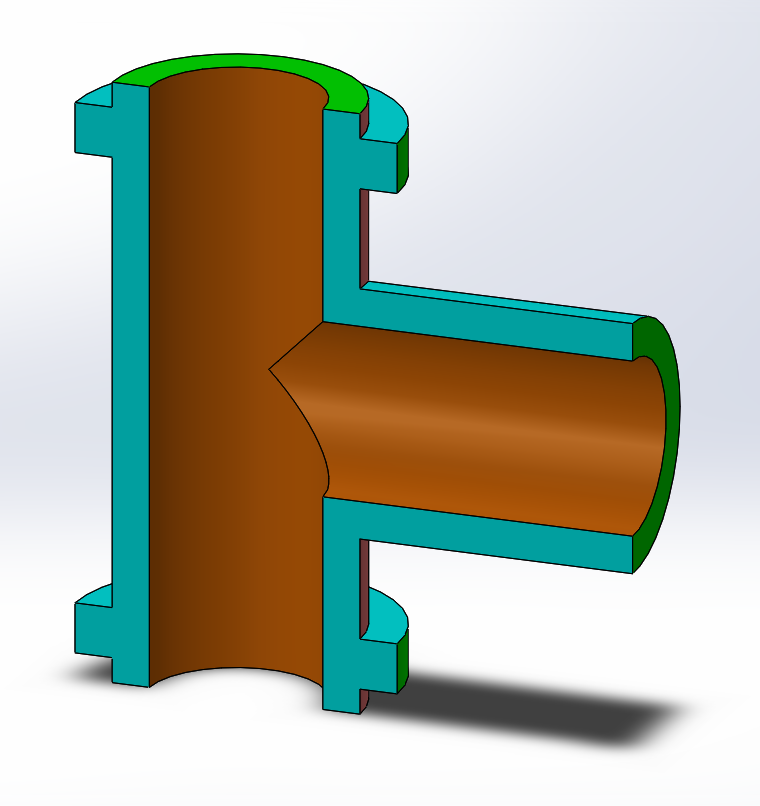
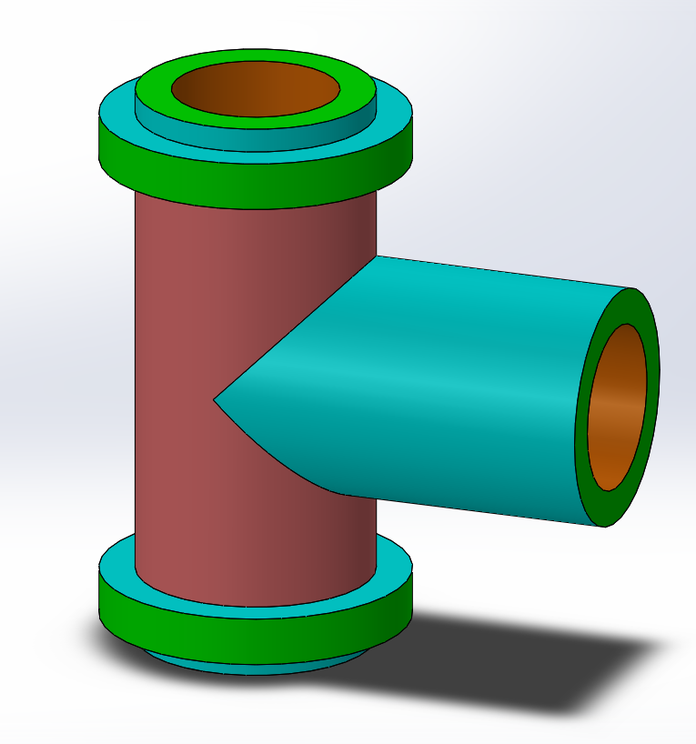

# Part-drawing-26-SW

# 🔩 Flanged Tee Pipe Fitting | SolidWorks 3D Model

## 📌 Overview

This project showcases a *Flanged Tee Pipe Fitting* modeled in *SolidWorks*, used in fluid and gas piping systems to allow redirection of flow at 90 degrees. The tee includes three equally sized flanged ports for easy bolt-on connections.

> ✅ Designed with precise engineering dimensions suitable for industrial applications and academic demonstrations.

---

## 🧱 Key Features

- *Tee-Shaped Design* (90° branch)
- *Flanged Connections* on all three ends
- *Internal Diameter*: ⌀50 mm
- *Outer Flange Diameter*: ⌀85 mm
- *Wall Thickness*: 10 mm
- *Branch Lengths*:
  - Vertical: 120 mm
  - Horizontal (branch): 80 mm

---

## 📐 Technical Drawing Included

The project includes a fully dimensioned 2D sectional drawing alongside the 3D model.  

Ideal for fabrication, analysis, or academic submission.

---

## 🎯 Applications

- Fluid transport systems

- HVAC networks

- Oil & gas pipelines

- Engineering education and modeling practice

---

 
## Author

Nishchay Sharma

>B.Tech (Mechanical Engineering)| Gold Medalist — 2024

>Design Engineer

Made with passion for cars and 3D printing. 

## File Include
- 'project26_nishchay.  SLDPRT' -
solidworks part file

## License
This project is licensed under the MIT license.

### Section View-

### Isometric View-

Thanks for Viewing!