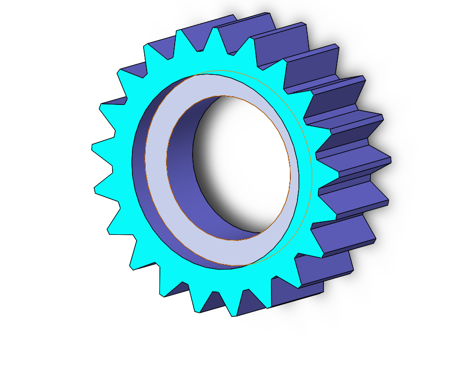

# Part-drawing-26-SW

# Spur Gear - SolidWorks 3D Model

This project contains a detailed 3D CAD model of a spur gear designed in *SolidWorks* as per the dimensions specified in *Exercise 29* from CADin360. The gear features precise inner and outer profiles, keyslot detailing, and proper sectional views to assist in manufacturing or academic visualization.

## 📐 Specifications

- *Outer Diameter*: 60 mm  
- *Hub Diameter*: 40.5 mm  
- *Bore Diameter*: 30 mm  
- *Keyslot Width*: 6 mm  
- *Keyslot Depth*: 3 mm  
- *Tooth Width*: 5 mm  
- *Tooth Height*: 10 mm  
- *Total Height*: 20 mm (Hub: 5 mm + Gear: 10 mm + Inner Cut: 5 mm)  
- *Chamfered Edge*: R25  
- *Material Assumed*: Mild Steel (can be modified)

## 🛠 Features

- Fully Parametric Design  

- Section A-A for Internal Clarity  

- Color-coded for easy part identification 
 
- Follows real-world manufacturing conventions

## 💻 Software Used

- *SolidWorks 2019 or later*

- Designed using Part Modeling and Section View Techniques

 
## Author

Nishchay Sharma

>B.Tech (Mechanical Engineering)| Gold Medalist — 2024

>Design Engineer

 

## File Include
- 'project27_nishchay.  SLDPRT' -
solidworks part file

## License
This project is licensed under the MIT license.

### Isometric View-

### 📌 Created by: *N1 CONCEPTION*

Thanks for Viewing!