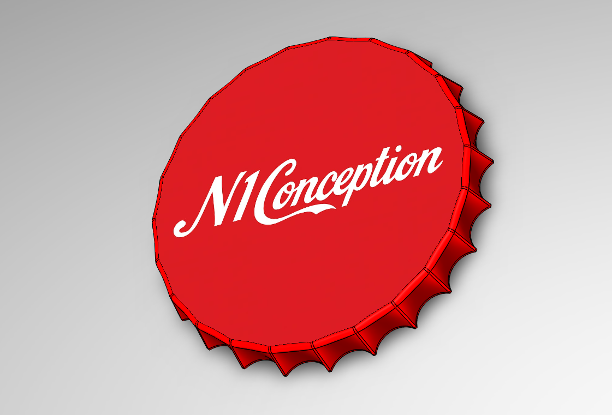

# Part-drawing-28-SW

# N1 Conception – Custom Bottle Cap Design (Coca-Cola Style)

A high-detail 3D bottle cap modeled in SolidWorks, inspired by the classic Coca-Cola design but re-imagined with **N1 Conception** branding. This project demonstrates advanced sketching, patterning, lofting, and decal application techniques to create a realistic, branded product model.  

---

## 🛠 Features

- **Custom Branding** – Classic Coca-Cola wavy script replaced with N1 Conception lettering.
  
- **Accurate Cap Geometry** – Modeled with realistic ridges, lofted dome, and authentic proportions.
  
- **Circular Pattern Efficiency** – Ridge details multiplied evenly using SolidWorks’ Circular Pattern tool.
  
- **Material & Decal Application** – Metallic finish with custom logo decal placement for realism.
  
- **Optimized for Rendering** – Clean feature tree and surfaces for high-quality renders.  

---

## 📌 Design Process Overview

1. **2D Base Sketch** – Circle foundation with evenly spaced dash points and ridge arcs.
  
2. **Ridge Creation** – Circular Pattern tool used to duplicate ~23 ridges around the perimeter. 
 
3. **Extrusion** – Base thickness of 0.1 mm applied for structure.  

4. **Dome Formation** – Lofted Boss from base to smaller top circle on an offset plane.  

5. **Branding & Color** – Metallic red finish with N1 Conception decal applied on top surface.  

---

## 💡 Inspiration
This design merges product modeling with creative branding—turning an everyday object into a personalized 3D art piece. Perfect for portfolio showcases, design challenges, or rendering practice.  

---

## 📜 License
This project is licensed under the MIT License – feel free to use, modify, and share with credit.  

 
## Author

Nishchay Sharma

>B.Tech (Mechanical Engineering)| Gold Medalist — 2024

>Design Engineer

 

## File Include
- 'project28_nishchay.  SLDPRT' -
solidworks part file

## License
This project is licensed under the MIT license.

### Isometric View-

### 📌 Created by: *N1 CONCEPTION*

Thanks for Viewing!