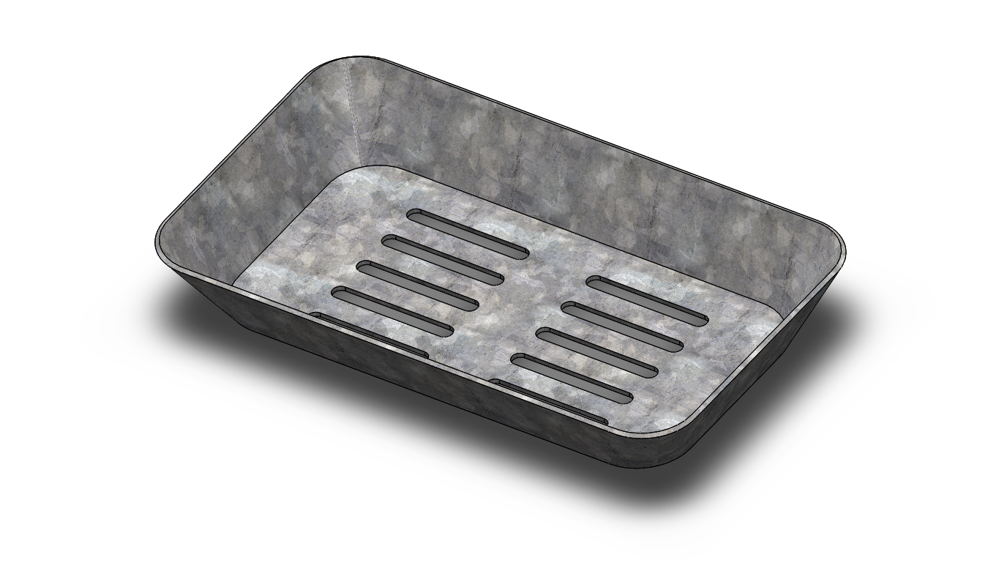

# Part-drawing-29-SW

# Surfaced Tray – SolidWorks

A clean, parametric **tray** modeled using **Surface tools** in SolidWorks.  
Focus is on smooth curvature control, G2 blends, and a clean knit → thicken workflow for fabrication or rendering.

---

---

## 🧰 Tools & Features Used

- **Reference geometry:** planes, construction sketches

- **Sketch splines** with curvature combs for rim and profile

- **Boundary Surface** / **Lofted Surface** for the bowl

- **Filled Surface** for end caps (where needed)

- **Surface Trim** / **Extend Surface** for cleanup

- **Knit Surface** (merge all) → **Thicken** to solid

- **Variable Fillet** on outer/inner lips for comfort & aesthetics

## 📜 License
This project is licensed under the MIT License – feel free to use, modify, and share with credit.  

 
## Author

Nishchay Sharma

>B.Tech (Mechanical Engineering)| Gold Medalist — 2024

>Design Engineer

 

## File Include
- 'project29_nishchay.  SLDPRT' -
solidworks part file

## License
This project is licensed under the MIT license.

### Isometric View-

### 📌 Created by: *N1 CONCEPTION*

Thanks for Viewing!