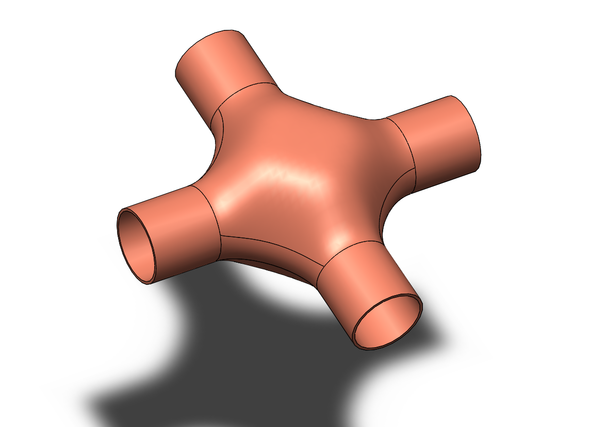

# Part-drawing-30-SW

# Quad Flow Connector | SolidWorks Surfacing  

Ever imagined engineering fused with art?  
Here’s the **Quad Flow Connector**, designed using **SolidWorks Surfacing techniques**.  

✨ **Highlights**  

- Crafted with precision surfacing methods  

- Showcases smooth blend and organic form  

- Focused on design aesthetics + functional concept  

🛠️ **Tools & Features Used**  

- Advanced Surfacing  

- Loft & Boundary Surfaces  

- Trim, Knit & Fillet  

- Connector Concept Visualization  

📂 **Repository Content**  

- SolidWorks Part File (`.SLDPRT`)  

- Preview Images of the Model  

## Author

Nishchay Sharma

>B.Tech (Mechanical Engineering)| Gold Medalist — 2024

>Design Engineer

 

## File Include
- 'project30_nishchay.  SLDPRT' -
solidworks part file

## License
This project is licensed under the MIT license.

### Isometric View-

### 📌 Created by: *N1 CONCEPTION*

Thanks for Viewing!