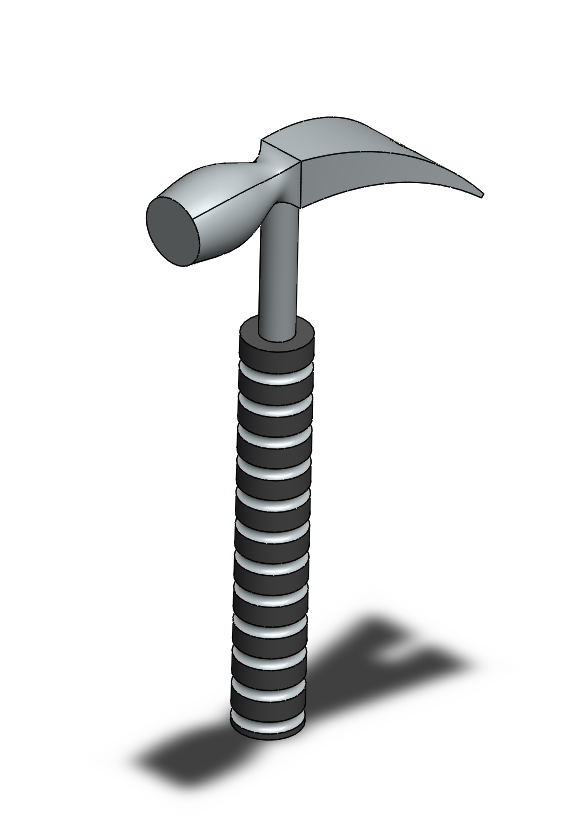
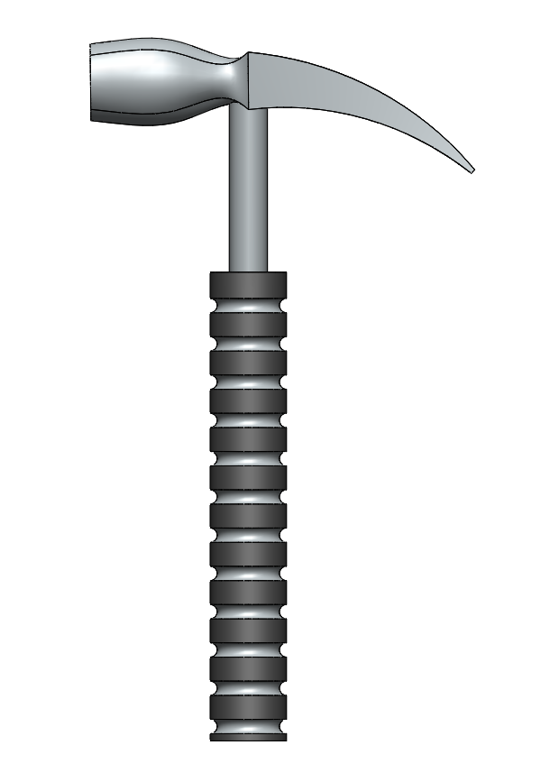

# Part-drawing-31-SW

# 🛠️ SolidWorks Hammer — Model

## 📘 Overview

This project showcases a **parametric 3D model** of a hand hammer designed in **SolidWorks**. 
 
The repository contains the individual part files.

Perfect for learning, visualization, or basic mechanical analysis.

---

## ⚙️ Software Compatibility

- **SolidWorks Version:** 2016 or later 
 
- **Default Units:** Millimeters (mm)  

---

## 🧠 Key Assumptions

- Designed for educational and visual demonstration purposes. 
 
- No internal cavities or forging allowances included.  

- Realistic proportions maintained for accurate appearance and balance.
  
- Materials can be changed for simulation or 3D printing.  

## Author

Nishchay Sharma

>B.Tech (Mechanical Engineering)| Gold Medalist — 2024

>Design Engineer

## File Include
- 'project31_nishchay.  SLDPRT' -
solidworks part file

## License
This project is licensed under the MIT license.

### Isometric View -

### Front View -

### 📌 Created by: *N1 CONCEPTION*

Thanks for Viewing!