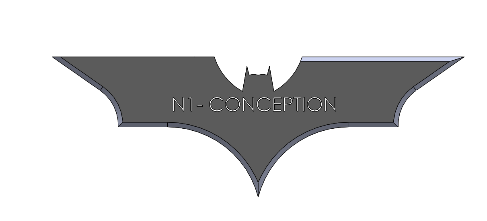

# Part-drawing-32-SW

# Batman Boomerang – SolidWorks Model

A stylized **Batman-inspired boomerang** designed in SolidWorks using surfacing and solid modelling techniques.  
This project focuses on sharp silhouettes, smooth contours, and a clean, aggressive profile — perfect for concept design, animation assets, or showcase modeling.

---

## 🦇 Overview

This model captures the iconic curved wing shape seen in Batman gadgets. 
 
Built with SolidWorks using:

- Precise sketches  

- Splines for contour shaping  

- Boundary & Loft features  

- Fillets for edge refinement  

- Cut-extrudes for detailing  

---

## 🛠️ Modeling Highlights

- Created using advanced sketching + surfacing workflow  

- Symmetrical layout with controlled curvature  

- Smooth transitions for a premium, cinematic look  

- Exported STEP file for easy reuse in other CAD/CG pipelines  

---

## 🎨 Rendering Tips

If you want the boomerang to look more realistic:

- Material: Matte black or brushed metal  

- Add subtle chamfers for highlighted edges  

- Use a dark studio HDRI with soft rim light  

---

## 🚀 Usage

You can use this model for:

- Portfolio showcase  

- Design projects  

- Game or animation mockups  

- Fan-art style engineering builds  

---

## 📜 License

MIT License — free to use, modify, and share.

-

## Author

Nishchay Sharma

>B.Tech (Mechanical Engineering)| Gold Medalist — 2024

>Design Engineer

## File Include
- 'project32_nishchay.  SLDPRT' -
solidworks part file

## License
This project is licensed under the MIT license.

### Isometric View -

### 📌 Created by: *N1 CONCEPTION*

Thanks for Viewing!