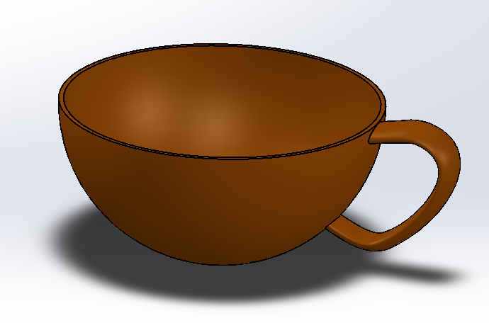
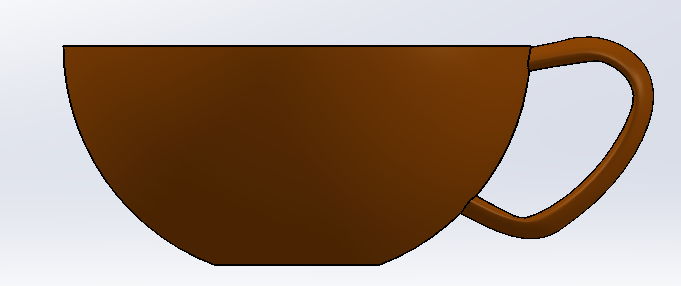

# Part-drawing-32-SW

# ☕ Cup | SolidWorks 3D CAD Model

A simple yet precisely modeled **3D Cup** created in **SolidWorks**. This project focuses on fundamental part modeling techniques, dimensional accuracy, and clean feature organization, making it ideal for beginners and CAD portfolio demonstrations.

## 📌 Project Overview

This model represents a standard cup designed using parametric CAD techniques. The project emphasizes creating smooth geometry, maintaining design intent, and following good modeling practices.

## ✨ Features

* Parametric design
* Smooth revolved geometry
* Clean feature tree
* Realistic appearance
* Manufacturing-friendly model

**Created by N1 Conception**

If you found this project helpful, consider ⭐ starring the repository.

## 📜 License

MIT License — free to use, modify, and share.

## Author

Nishchay Sharma

>B.Tech (Mechanical Engineering)| Gold Medalist — 2024

>Design Engineer

### Isometric View -

### Front View -

### 📌 Created by: *N1 CONCEPTION*

Thanks for Viewing!